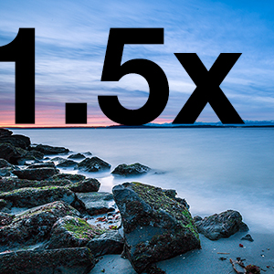
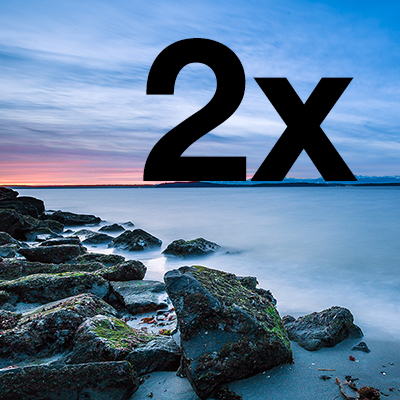
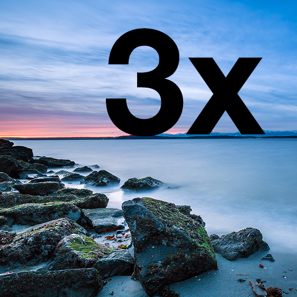

# srcset

Demo version: https://russmaxdesign.github.io/srcset/

A simple test to determine if devices will display different images based on their device-pixel-ratio - using the  `srcset` attribute.

```
  
```


- Devices that have 1x device pixel ratio should display an image labelled "1x"
- Devices that have 1.5x device pixel ratio should display an image labelled "1.5x"
- Devices that have 2x device pixel ratio should display an image labelled "2x"
- Devices that have 3x device pixel ratio should display an image labelled "3x"

Images are sized according to the following ration:

| Ratio | Size |
|-------|------|
| 1x    | 200  |
| 1.5x  | 300  |
| 2x    | 400  |
| 3x    | 600  |








See [Licence information](LICENCE) for use.
